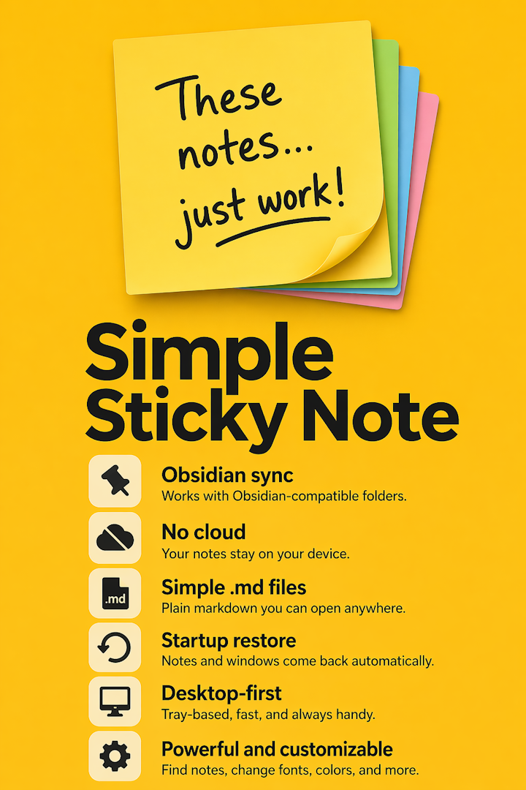
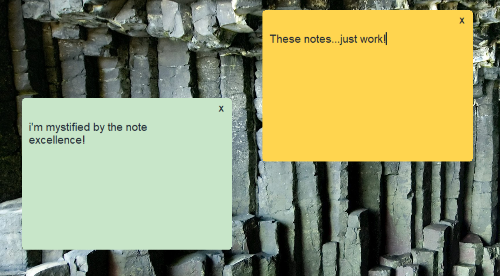
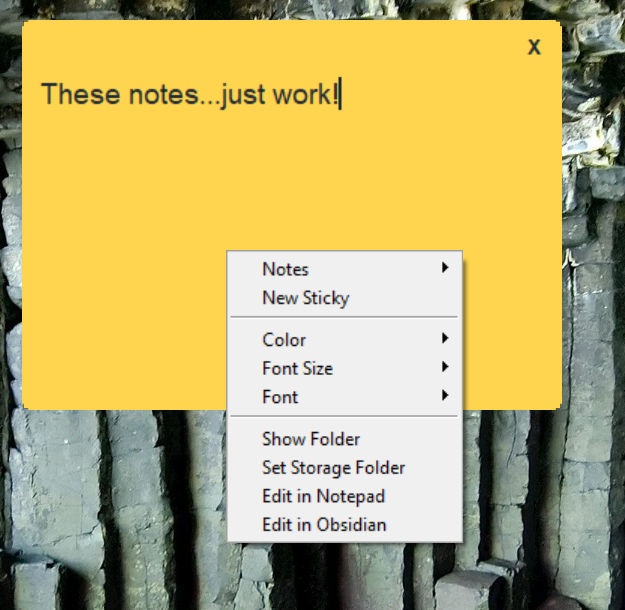
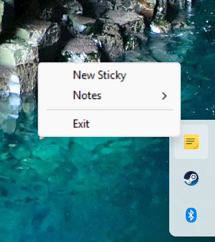
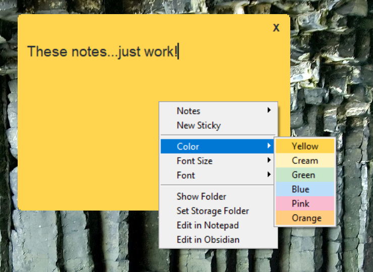

# Simple Sticky Notes

Simple Sticky Notes is a Windows desktop sticky-note companion app that stores note bodies as markdown files in the active Obsidian vault when one is available, with markdown files that Obsidian can read directly.

The app is intentionally **not** built on top of Obsidian as the runtime. Obsidian remains a useful companion for editing, searching, and browsing the same markdown files, but the sticky-note windows themselves are owned by a standalone Windows app so they can remain visible and restorable independent of Obsidian.

## Goals

- Frameless desktop sticky-note windows
- Custom close button without a normal Windows title bar
- Resizable note windows
- Reliable autosave
- Markdown note storage plus sidecar metadata
- 2-way shared-file sync with Obsidian edits
- Restore open notes and positions after reboot/login
- Fast desktop shortcut for creating a new note
- Obsidian-compatible file storage

## Current Status

This repo is in active prototyping. The current implementation includes:

- Python/Tkinter app scaffold
- Markdown file storage inside the active Obsidian vault when available
- Sidecar metadata for note geometry and open/closed state
- Stable markdown filenames based on each note title at creation time, with uniqueness suffixes when needed
- Frameless note window shell with custom close button
- System tray icon with background-app exit controls
- Windows desktop/startup shortcut installer
- Right-click note menu for note switching, colors, fonts, and storage-folder changes
- External file polling so open stickies can reload markdown edits made from Obsidian
- Paste images from the clipboard straight into a note — shown inline in the sticky as a thumbnail, saved under the vault's `_attachments/` folder, and stored as an Obsidian `![[image]]` wikilink (so it renders in Obsidian and on the phone too)
- Built Windows installer flow with detected-vault storage prefill
- Automated tests for storage, menu behavior, runtime recovery, and Obsidian integration
- Windows icon assets for the app

## Screenshots

### Desktop Notes



### Note Context Menu



### Tray Menu



### Color Menu



## Project Docs

- [STATUS.MD](STATUS.MD)
- [bugs.md](bugs.md)
- [regression_tests.md](regression_tests.md)
- [MRD](docs/MRD.md)
- [Architecture](docs/ARCHITECTURE.md)
- [Development](docs/DEVELOPMENT.md)
- [Roadmap](docs/ROADMAP.md)
- Store docs below are kept for deferred packaging work and prior Partner Center research:
- [Store Submission](docs/STORE_SUBMISSION.md)
- [Store Listing Draft](docs/STORE_LISTING_DRAFT.md)
- [Store Assets Checklist](docs/STORE_ASSETS_CHECKLIST.md)
- [Privacy Policy Draft](docs/PRIVACY_POLICY_DRAFT.md)
- [Contributing](CONTRIBUTING.md)

## Quick Start

### Run the app

```powershell
python main.py
```

### Create a new note directly

```powershell
python main.py --new-note
```

### Install desktop and startup shortcuts

```powershell
python main.py --install-windows-integration
```

### Build the packaged app and installer

```powershell
powershell -NoProfile -ExecutionPolicy Bypass -File installer\build.ps1
```

### Run the sticky-note MCP server

```powershell
node mcp-server/index.js
```

This repo is also registered in the shared Whitkin app registry as `simple-sticky-notes`, with the MCP server as its canonical transport.

### Obsidian "Open as sticky note" plugin

`obsidian-plugin/` is a small Obsidian plugin that adds an **"Open as sticky note"**
command / right-click item / ribbon button. It tells the running desktop app (via its
`127.0.0.1:38473` socket) to open the current note as a real sticky window — adopting a
vault-root note into a sticky if needed. See [`obsidian-plugin/README.md`](obsidian-plugin/README.md).

### Android companion app

`android/` contains a Kotlin home-screen widget app that reads/writes the **same**
vault markdown files (via Syncthing), using the identical `stickynote`-tag + sidecar
format. `Frontmatter.kt` is a byte-compatible port of `storage.py`, verified by a
unit-test suite that mirrors the Python tests. Build and wireless-deploy instructions
are in [`android/README.md`](android/README.md).

```powershell
cd android
.\gradlew.bat test assembleDebug   # -> simple-sticky-notes-1.0-debug.apk
```

### Move the repo folder

The repo itself is safe to move to another folder. After the move, rebuild the Windows shortcuts so the desktop and startup launchers stop pointing at the old path:

```powershell
python main.py --install-windows-integration
```

### Run tests

```powershell
python -m unittest -v
```

## Storage Layout

By default note data is stored under:

`<active Obsidian vault>\Simple Sticky Notes\`

If no Obsidian vault is available yet, the app falls back to `%USERPROFILE%\Documents\Simple Sticky Notes\`.

The storage layout is:

- `<note title>.md` for note bodies, based on the first 10 words when the note is created
- `.simple-sticky-notes/meta/<note-id>.json` for window state and session metadata

This keeps the markdown notes directly visible in Obsidian while the desktop app manages position, size, and runtime state in a hidden sidecar folder. If two notes would produce the same filename, the app adds `-1`, `-2`, and so on. The filename stays stable after creation so editing in Obsidian does not rename the file while you type.

## Repo Layout

```text
.
|-- android/                 # Kotlin home-screen widget companion app
|-- assets/
|   `-- icons/
|-- docs/
|-- mcp-server/
|-- simple_sticky_notes/
|-- tests/
|-- tools/
|   `-- vault-maintenance/   # one-off vault dedup / retitle / near-dup scripts
|-- main.py
|-- STATUS.MD
|-- bugs.md
`-- regression_tests.md
```

## Design Direction

- The desktop app is the runtime owner of notes.
- Obsidian is a secondary tool that reads the same markdown files.
- The app can stay alive in the tray even when all notes are hidden.
- A future Obsidian control panel plugin is acceptable, but it should not become the sticky-note runtime.

## Why Not Obsidian Pop-Outs?

Obsidian pop-out windows are tied to Obsidian itself. That fails a key requirement for this project: sticky notes must remain restorable and desktop-native even when Obsidian is not running.

## Compared With Microsoft Sticky Notes

Microsoft Store distribution is currently deferred.

Microsoft Sticky Notes does cover some adjacent use cases well. According to Microsoft Support, it:

- reopens notes where you left them
- can sync notes across Windows, web, OneNote mobile apps, and Outlook when you sign in with a Microsoft account
- supports search across notes
- supports export through Outlook.com for synced notes

That still does not match this project's core goals.

- Microsoft stores synced notes in Microsoft's cloud and Outlook.com rather than as markdown files in an Obsidian-readable folder.
- This project keeps the desktop app as the runtime owner while storing note bodies as normal `.md` files plus sidecar metadata under the user's chosen storage root.
- This project is specifically optimizing for Obsidian-compatible local file storage, Windows shortcut workflows, startup restore, and direct file interoperability instead of Microsoft-account-centric sync.

So the short answer is: no, Microsoft Sticky Notes does not already provide all of the features this project is targeting, especially around local markdown storage and Obsidian-compatible file ownership.

## Roadmap Summary

- Finish the standalone note runtime
- Harden session restore and startup behavior
- Improve Windows integration and packaging
- Add an optional Obsidian-side control panel

See [docs/ROADMAP.md](docs/ROADMAP.md) for more detail.
